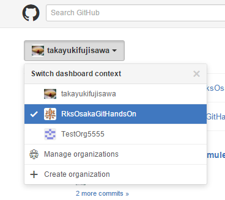
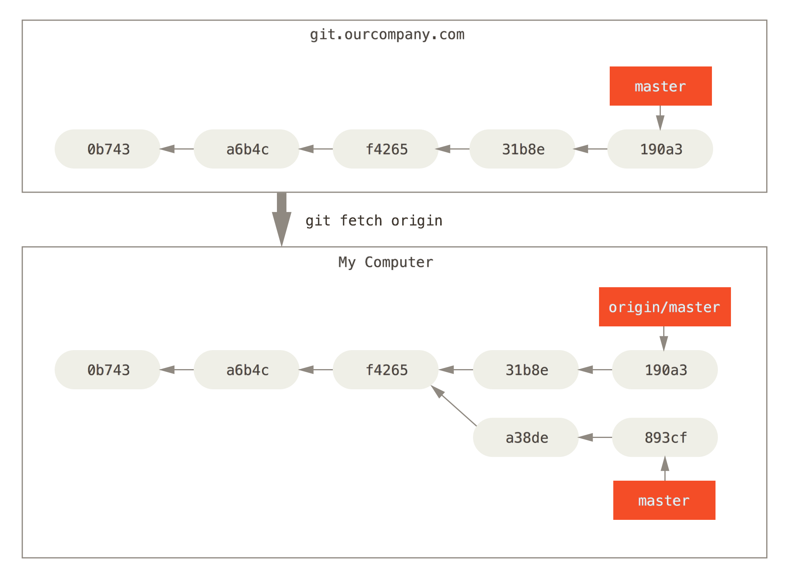

# 第2回 Gitハンズオン勉強会

## アジェンダ

1. 前回のおさらい
1. 基本的なGitコマンド操作の学習③
    * リモートリポジトリの変更をローカルに反映する（fetch, merge, pull）
1. Gitホスティングサービスを使った複数人によるバージョン管理
    * Issueの作成と、commit、push
    * Pull Requestからの、コードレビュー、merge
    * コンフリクトの解消
1. 基本的なGitコマンド操作の学習④
    * 様々なmerge(fast-forward, non-fast-forward, rebase)

## 前回のおさらい

```bash
# リポジトリのclone
$ git clone <リモートリポジトリのURL>
# ブランチの作成
$ git checkout -b <ブランチ名>
# ブランチの切り替え
$ git checkout <ブランチ>
# ブランチの一覧
$ git branch
# 変更したファイルのステージング（コミット対象化)
$ git add <ファイル or ディレクトリのpath>
# コミット
$ git commit -m "<コミットメッセージ>"
# リモートリポジトリへの反映
$ git push <リポジトリ名> <ブランチ名>
```

## はじめに

今回は、GithubのOrganization機能でリポジトリを共有しながら進めます。
Githunのダッシュボードを個人用からOrganization用に切り替えるには、以下のようにOrganization名を選択してください。



## 基本的なGitコマンド操作の学習③

### リモートリポジトリの変更をローカルに反映する（fetch, merge, pull）

### 事前準備
* 以下のリポジトリをローカルにcloneする
`https://github.com/RksOsakaGitHandsOn/2ndclass_step1.git`

#### 1. リモートリポジトリに変更を加える

*この作業は講師が行います*

```bash
$ echo "Hello Git." >> README.md
$ git add README.md
$ git commit -m "READMEを修正しました"
$ git push origin master
```

#### 2. リモートリポジトリの変更をローカルリポジトリに反映する

Gitでリモートリポジトリの変更をローカルに反映するには、おおまかに以下のステップを踏みます。
（詳しく知りたい方向けに後述します）

1. ローカルにリモートの変更履歴だけを取り込む (`fetch`)
1. 変更履歴に基づく差分を、ローカルブランチに反映する (`merge`)

```bash
# リモートリポジトリ上での変更を取得する
$ git fetch
# ローカルのブランチにマージする
$ git merge <マージ元ブランチ名> [マージ先ブランチ名]
```

* [マージ先ブランチ名]を省略した場合、カレントブランチにマージします

*実行例*

```bash
$ gti checkout master
$ git fetch
$ git merge origin/master
```

**(補足) git pull**

fetchとmergeを同時に行ってくれる、`pull`という方法もあります。

```bash
# 以下のコマンドで fetch + merge と同じ結果が得られる
$ git pull origin
```

ただし、`git pull`はmergeまで一気に実行するため、意図せずリモートの変更をローカルに反映してしまう場合があります。慣れないうちは `git fetch` + `git merge` を使うほうが良いでしょう。

> 前回の勉強会で.gitconfigのmegre.ffをfalseに設定している方は、git logを実行するとマージのコミットログが増えていることが確認できるはずです。
> 別のブランチからmaster等の統合ブランチにmergeを行う場合、マージした履歴を残すため、マージコミットを残す事が一般的です。しかし、今回のようにリモートの変更をローカルに反映するmergeにまでマージコミットを残したくありません。
> これを解消する便利な方法があるのですが、これについては、後ほど説明します。

## Gitホスティングサービスを使った複数人によるバージョン管理

### 事前準備

* 以降の作業は２人一組でそれぞれ **管理者** と **作業者** に役割を決めてお互いの画面を見ながら進めます。
* Github上に、ペア毎にリポジトリを１つ作成してください。
* 各自、作成したリポジトリをローカル上にcloneしてください。

### 1. Issueの作成と、commit、push

Issue駆動で作業の発生からソースを変更してpushをする流れを確認します。

#### 1-1. (管理者) Github上でIssueを作成する　

```
1. Issuesページから[New Issue]を押下
2. タイトルと本文を入力(ここでは、README.mdファイルを変更する旨を記載してください)
3. Assigneeに作業者を指定
4. [Submit new issue]を押下
```

* Issueページへのリンク


* New issueボタン


* Issueの作成と担当者の設定


#### 1-2. (作業者) Issueを確認し、Issue対応用のブランチを作成する

以下のページから、自分にIssueが割り当てられていることを確認します。

* Issueリストの表示


```bash
$ cd <cloneした作業ディレクトリ>
# Issue対応用のブランチを作成する
$ git checkout -b issue/#1
```

#### 1-3. (作業者) ファイルに変更を加え、commitする

コミットメッセージに`#[Issue番号]`を含めることで、コミットとIssueを紐付けることができます。

```bash
# ファイルの編集
$ vi README.md
$ git commit -m "変更しました #1"
```

#### 1-4. (作業者) リモートリポジトリにpushする

```bash
$ git push origin issue/#1
```

Github上でコミットログが追加され、コミットとIssueがリンクしていることを確認してください。

* コミットログ


* Issueにも反映


### 2. Pull Requestからの、コードレビュー、merge

Pull Requestを元に、Github上でコードレビューを行い、ソースコードのマージを行う流れを確認します。

#### 2-1. (作業者) Pull Requestを作成する

```
1. リポジトリのトップページの[Compare & pull request]を押下
2. タイトルと本文を入力する
3. 担当を管理者に割り当てる（Assignee）
4. [Create pull request]を押下
# この時、次の2点に注目してください
 ・base[マージ先]とcompare[マージ元]が意図したものになっていること（例base:master compare:issue/#1)
 ・[Able to merge]と表示されていること
```

* Pull Requestの発行ボタン


* Pull Requestの作成


#### 2-2. (管理者) 変更点をレビューし、レビューコメントを残す

```
1. Pull RequestページのAssignedから、自分に割り当てられているPull Requestを確認する
2. File changedタブを選択し、変更差分を確認する
3. 行頭の[＋]マークをクリックし、コメントを入力
4. Conversationタブに戻り、Assigneeを作業者に変更
```

* Pull Requestリストの表示


* コードレビュー


* レビューコメントの入力


* 担当者の変更


#### 2-3. (作業者) 再度ファイルを修正し、commit + push

```
1. Pull RequestページのAssignedから、自分に割り当てられているPull Requestを確認する
2. 指摘内容に従ってファイルを修正する
```

```bash
$ vi README.md
$ git commit -m "指摘修正 #1"
$ git push origin issue/#1
```

#### 2-4. (作業者) 再レビュー依頼する

```
1. Conversationタブを選択し、画面下部のコメント欄に再レビュー依頼コメントを記載する
2. Assigneeを管理者に変更する
```

* 再レビュー依頼コメント


#### 2-4. (管理者) 再レビューし、mergeする

```
1. Pull RequestページのAssignedから、自分に割り当てられているPull Requestを確認する
2. File changedタブを選択し、指摘内容が修正されていることを確認する
3. [Merge pull request]を押下
4. mergeコメントを入力し[Confirm merge]を押下
5. [Delete branch]を押下
```

* Merge pull requestボタン


* マージ実行


* ブランチ削除


#### 2-5. (管理者) (作業者) masterブランチを最新化して、変更がmasterブランチにmergeされていることを確認する

```bash
$ git checkout master
$ git fetch
$ git rebase origin/master
```

`git log`や、ファイルの中身を確認し、Github上で受け入れたPull Requestの内容がmasterブランチに反映されていることを確認してください。

>ここで、ブランチの統合にmergeではなく、rebaseというコマンドを使用しています。
>冒頭でご説明した、リモートの変更を取り込む際にマージコミットを残さない方法がこちらです。
>rebaseも、mergeと同様にブランチの統合を行うコマンドですが、コミットを残さないという特徴があります。
>両者の使い分けはきちんとした根拠があるのですが、それについては「様々なブランチ統合」の節を参照してください。

### 3. コンフリクトの解消

コンフリクトが発生した場合の解消方法について確認します。

#### 3-1. (作業者) conflict実験用ブランチを作成し、pushする

```bash
$ git checkout -b conflict_test
$ echo "hogehoge" >> README.md
$ echo "abcde" > alphabet.txt
$ echo "12345" > number.txt
$ git add .
$ git commit -m "コンフリクトしませんように"
$ git push origin conflict_test
```

#### 3-2. (管理者) 意図的にコンフリクトを起こすため、masterブランチを変更し、pushする

```bash
$ git checkout master
$ echo "fugafuga" >> README.md
$ echo "fghij" > alphabet.txt
$ echo "67890" > number.txt
$ git add .
$ git commit -m "コンフリクトさせてやる"
$ git push origin master
```

#### 3-3. (作業者) Pull Requestを作成する

```
1. リポジトリのトップページの[Compare & pull request]を押下
2. タイトルと本文を入力する
3. 担当を管理者に割り当てる（Assignee）
4. [Create pull request]を押下
5. [Can’t automatically merge]と表示されていることを確認してください。
```

※本来はこの時点でmasterブランチとコンフリクトが発生していることがわかるため、Pull Requestは作成せず、コンフリクトの解消を図ります。

* コンフリクト警告


* マージできない


#### 3-4. (管理者) Pull Requestを確認する

```
1. Pull Requestページに移動
2. [Merge pull request]が押下できないことを確認する
3. コンフリクトが発生しているためマージできない旨をコメントに記載
4. Assigneeを担当者に変更
```

#### 3-5. (作業者) コンフリクトを解消する

masterブランチの最新の更新を取得します。

```bash
$ git checkout master
$ git fetch
$ git rebase origin/master
```

masterのマージを試みると、コンフリクトが発生します。

```bash
$ git checkout conflict_test
$ git merge master
Auto-merging number.txt
CONFLICT (add/add): Merge conflict in number.txt
Auto-merging alphabet.txt
CONFLICT (add/add): Merge conflict in alphabet.txt
Auto-merging README.md
CONFLICT (content): Merge conflict in README.md
Automatic merge failed; fix conflicts and then commit the result.
```

ここからコンフリクトの解消に移ります。

```bash
$ git status
On branch conflict_test
You have unmerged paths.
  (fix conflicts and run "git commit")

Unmerged paths:
  (use "git add <file>..." to mark resolution)

        both modified:   README.md <-- コンフリクト
        both added:      alphabet.txt <-- コンフリクト
        both added:      number.txt <-- コンフリクト
```


ここでは以下の方針でコンフリクトを解消することにします。

- alphabet.txt → masterブランチの変更を採用
- number.txt → conflict_testブランチの変更を採用
- README.md → 内容を精査して手動マージ

```bash
# マージ元ブランチの変更を採用
$ git checkout --theirs alphabet.txt
# マージ先ブランチの変更を採用
$ git checkout --ours number.txt
# 手動で編集し、マージ
$ vi README.md
# git addすることでマージ済扱いとなる
$ git add .
$ git commit -m "コンフリクト解消"
$ git push origin conflict_test
```

> ちなみに、マージ作業でわけがわからなくなったら`git checkout --merge [ファイル名]`または`git checkout --merge .`でmergeコマンド実行直後の状態まで戻る事ができます。

#### 3-6. (管理者) 変更点をmergeする

```
1. Pull Requestページに移動
# コンフリクトが解消されたのでMerge可能になっていることを確認してください。
2. [Merge pull request]を押下
3. Mergeコメントを入力し[Confirm merge]を押下
4. [Delete branch]を押下
```

## 基本的なGitコマンド操作の学習④

### 様々なブランチ統合 (fast-forward, non-fast-forward, rebase)

#### fast-forward と non-fast-forward
Gitのmergeには、fast-forward(早送り)、non-fast-forwardというオプションがあります。両者の違いは、「マージをした」という操作に対してコミットログを残すか、残さないか、というものです。

|モード|コマンド|マージコミットのログ|
|:-----------|:------------|:-----------|
| fast-forward | git merge --ff | 残さない |
| non-fast-forward | git merge --no-ff | 残す |

`~/.gitconfig`で下記の設定を行っていると、オプションを指定しない場合、常に`--no-ff`でマージを行うようになります。

```bash
[merge]
    ff = false
```

それでは、実際に２つのオプションをそれぞれ使用して、コミットログの差異を確認しましょう。

1. リポジトリを作成する

    ```bash
    $ cd
    # リポジトリ用ディレクトリ作成
    $ mkdir ff_noff_test
    $ cd ff_noff_test
    $ touch test.txt
    # リポジトリの初期化とコミット
    $ git init
    $ git add .
    $ git commit -m "1st commit on master"
    ```

1. ブランチで変更を加え、それぞれのオプションでマージを実行する

    **fast-forward の場合**

    ```bash
    # ブランチを作成
    $ git checkout -b topic
    # ファイルに変更を加えてコミットする
    $ echo "aiueo" >> test.txt
    $ git commit -m "topic commit"
    # masterブランチに切り替える
    $ git checkout master
    # topicブランチの変更をmasterブランチに統合(fast-forward)
    $ git merge --ff topic
    # コミットログにマージコミットが含まれていないことを確認する
    $ git log
    ```

    **non-fast-forward の場合**

    ```bash
    # 再度topicブランチで変更を加える
    $ git checkout topic
    $ echo "kakikukeko" >> test.txt
    $ git commit -m "topic commit2"
    $ git checkout master
    # topicブランチの変更をmasterブランチに統合(non-fast-forward)
    $ git merge --no-ff topic
    # コミットログにマージコミットが含まれていることを確認する
    $ git log
    ```

### merge と rebase
Gitでブランチ間の変更を統合する方法はmergeの他にrebaseという方法があります。

|コマンド|振る舞い|
|:-----------|:------------|
| merge | 統合先(master)に、統合元(topic)の変更を、時系列順に合流させる |
| rebase | 統合元(topic)の変更を、統合先(master)の変更の<strong>後に</strong>、<strong>別のコミットとして</strong> 再登録する |

* mergeとrebaseの違い


それでは、実際に２つのブランチの統合をmerge/rebaseそれぞれで行い、コミットログの差異を確認しましょう。

1. リポジトリを作成する

    ```bash
    $ cd
    # リポジトリ用ディレクトリ作成
    $ mkdir merging_test
    $ cd merging_test
    $ echo "1234" >> test.txt
    # リポジトリの初期化とコミット
    $ git init
    $ git add .
    $ git commit -m "1st commit on master"
    ```

1. 2つのブランチでそれぞれ変更を加える

    ```bash
    # 現時点のmasterを元にtopicブランチを作成
    $ git checkout -b topic
    # masterブランチに戻って変更を加える
    $ git checkout master
    $ echo "5678" >> test.txt
    $ git add .
    $ git commit -m "2nd commit on master"
    # topicブランチに移動して変更を加える
    $ git checkout topic
    $ echo "aiueo" >> test2.txt
    $ git add .
    $ git commit -m "commit on topic"
    # masterブランチに戻る
    $ git checkout master
    ```

3. リポジトリを２つcloneして、mergeとrebaseの違いを確認する

    ```bash
    $ cd
    # リポジトリをcloneする
    $ git clone merging_test for_merge
    $ git clone merging_test for_rebase
    ```

    まずはmergeの確認

    ```bash
    $ cd ~/for_merge
    $ git merge origin/topic
    # merge後のコミットログを確認
    $ git log --graph --oneline --decorate
    ```

    次にrebaseの確認

    ```bash
    $ cd ~/for_rebase
    $ git rebase origin/topic
    # rebase後のコミットログを確認
    $ git log --graph --oneline --decorate
    ```

上記で、以下の違いが確認できるかと思います。

* merge
    * マージコミットが作成されていること
    * 各コミットのハッシュ値が変化していないこと
* rebase
    * マージコミットが作成されていないこと
    * 各コミットの時系列順やハッシュ値が変化していること

rebaseについては、実行前と実行後で既にコミットされた変更が、別のコミットとして登録されてしまうので、既にリモートリポジトリにpush済みの場合などは注意が必要です。（他の人が取り込んでいると、rebase後取り込みに失敗したり、pushに失敗したりする）

したがって、運用に慣れない間は、特に必要が無い場合、次の用途を除いてrebaseの使用を避ける方が良いとされています。

### rebaseを安心して使えるケース

ローカルでは変更が発生せず、リモート側の変更を取り込むだけのブランチ統合の場合、rebaseを使用しても問題が発生する事はありません。
また、rebaseのマージコミットが残らないという特性を活かし、以下のような運用をすることが一般的です。

1. merge時のオプションは必ず`--no-ff`を使用するよう`~/.gitconfig`に設定する
2. master等の統合ブランチの最新化は `fetch` + `rebase` で行う

```bash
$ git fetch origin
$ git rebase origin/master master
```

また、同じことを`git pull`に`--rebase`オプションを付けることでも実現できます。

```bash
$ git pull --rebase origin
```

`git pull`が fetch + merge を一度に行ってくれるのに対し、`git pull --rebase`は fetch + rebase を一度に行ってくれる事を意味します。


## (補足) fetch + mergeの意味を詳しく知りたい人向け資料

fetchとmergeを理解するには、まずGitのブランチの種類を知る必要があります。
Gitのブランチは大きく以下の３つのブランチに分類されます。

|種類|説明|場所|
|:-----------|:------------|:-----------:|
| リモートブランチ | リモートリポジトリ上のブランチ | リモート |
| リモート追跡ブランチ | リモートブランチと関連付けられたローカル上のブランチ| ローカル |
| ローカルブランチ | ローカル上の作業ブランチ | ローカル |


リモート追跡ブランチはcloneやfetchを実行した際に、自動でローカル上に作成されます。
ローカル上に存在するブランチは、`git branch -a`で確認する事ができ、それぞれ以下のブランチを示しています。

```bash
$ git branch -a
* master # ローカルブランチ
remotes/origin/HEAD -> origin/master
remotes/origin/master　# origin上のmasterブランチのリモート追跡ブランチ
```

* ブランチのイメージ図


上記を踏まえて、fetchとmergeがそれぞれ何をやっているかを解説します。

* `git fetch` →　リモートブランチの変更をリモート追跡ブランチに取り込む
* `git merge <リモート追跡ブランチ> <ローカルブランチ>` →　ローカルブランチにリモート追跡ブランチの内容をマージする

リモートの変更をローカルに取り込もうとする際、思いがけずコンフリクトが発生してしまうことがあります。そんな時は上記を思い出して下さい。
