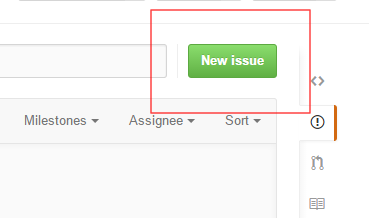

# 第2回 Gitハンズオン勉強会

## アジェンダ

1. 前回のおさらい
1. 基本的なGitコマンド操作の学習③
    * リモートリポジトリの変更をローカルに反映する（fetch, merge, pull）
1. Gitホスティングサービスを使った複数人によるバージョン管理
    * Issueの作成と、commit、push
    * Pull Requestからの、コードレビュー、merge
    * コンフリクトの解消

**補足資料**

* [様々なブランチ統合 (fast-forward, non-fast-forward, rebase)](./2nd_follow.md)
    * fast-forward と non-fast-forward
    * merge と rebase
    * rebaseを安心して使えるケース

## 前回のおさらい

```bash
# リポジトリのclone
git clone <リモートリポジトリのURL>
# ブランチの作成
git checkout -b <ブランチ名>
# ブランチの切り替え
git checkout <ブランチ>
# ブランチの一覧
git branch
# 変更したファイルのステージング（コミット対象化)
git add <ファイル or ディレクトリのpath>
# コミット
git commit -m "<コミットメッセージ>"
# リモートリポジトリへの反映
git push <リポジトリ名> <ブランチ名>
```

## はじめに

今回は、GithubのOrganization機能でリポジトリを共有しながら進めます。
Githunのダッシュボードを個人用からOrganization用に切り替えるには、以下のようにOrganization名を選択してください。


## 基本的なGitコマンド操作の学習③

### リモートリポジトリの変更をローカルに反映する（fetch, merge, pull）

### 事前準備
* 以下のリポジトリをローカルにcloneする

    https://github.com/RksOsakaGitHandsOn/2ndclass_step1.git

#### 1. リモートリポジトリに変更を加える

*この作業は講師が行います*

```bash
echo "Hello Git." >> README.md
git add README.md
git commit -m "READMEを修正しました"
git push origin master
```

#### 2. リモートリポジトリの変更をローカルリポジトリに反映する

Gitでリモートリポジトリの変更をローカルに反映するには、おおまかに以下のステップを踏みます。

1. ローカルにリモートの変更履歴だけを取り込む (`fetch`)
1. 変更履歴に基づく差分を、ローカルブランチに反映する (`merge`)

```bash
# リモートリポジトリ上での変更を取得する
git fetch
# ローカルのブランチにマージする
git merge <src branch> [<dist branch>]
```
* `src branch`を`dist branch`にマージします
* `dist branch`を省略した場合、カレントブランチにマージします

*実行例*

```bash
gti checkout master
git fetch
# リモートのmasterブランチの変更を、ローカルのmasterブランチ(カレントブランチ)にマージ
git merge origin/master
```

`~/.gitconfig`の`megre.ff`を`false`に設定している場合、`git log`を実行するとマージのコミットログが増えていることが確認できます。

**(補足) マージコミット**

topicブランチからmaster等の **統合ブランチへのmerge** を行う場合、「マージした」という履歴を残すため、マージコミットを残す事が一般的です。
しかし、今回のようにリモートの変更をローカルに反映するmergeではマージコミットを残したくありません。その場合、`git merge`の代わりに`git rebase`を行います。詳細は、[様々なブランチ統合 (fast-forward, non-fast-forward, rebase)](./2nd_follow.md)を参照してください。

**(補足) git pull**

fetchとmergeを同時に行ってくれる、`pull`という方法もあります。

```bash
# 以下のコマンドで fetch + merge と同じ結果が得られる
git pull origin
```

ただし、`git pull`はmergeまで一気に実行するため、意図せずリモートの変更をローカルに反映してしまう場合があります。慣れないうちは `git fetch` + `git merge` を使うほうが良いでしょう。

## Gitホスティングサービスを使った複数人によるバージョン管理

### 事前準備

* 以降の作業は２人一組でそれぞれ **管理者** と **作業者** に役割を決めてお互いの画面を見ながら進めます。
* Github上に、ペア毎にリポジトリを１つ作成してください。
* 各自、作成したリポジトリをローカル上にcloneしてください。(ホームディレクトリに移動して実行してください)

### 1. Issueの作成と、commit、push

Issue駆動で作業の発生からソースを変更してpushをする流れを確認します。

#### 1-1. (管理者) Github上でIssueを作成する　

```
1. Issuesページから[New Issue]を押下
2. タイトルと本文を入力(ここでは、README.mdファイルを変更する旨を記載してください)
3. Assigneeに作業者を指定
4. [Submit new issue]を押下
```

* Issueページへのリンク

    

* New issueボタン

    

* Issueの作成と担当者の設定

    

#### 1-2. (作業者) Issueを確認し、Issue対応用のブランチを作成する

以下のページから、自分にIssueが割り当てられていることを確認します。

* Issueリストの表示

    


```bash
cd <cloneした作業ディレクトリ>
# Issue対応用のブランチを作成する
git checkout -b issue/#1
```

#### 1-3. (作業者) ファイルに変更を加え、commitする

コミットメッセージに`#[Issue番号]`を含めることで、コミットとIssueを紐付けることができます。

```bash
# ファイルの編集
vi README.md
git add .
git commit -m "変更しました #1"
```

#### 1-4. (作業者) リモートリポジトリにpushする

```bash
git push origin issue/#1
```

Github上でコミットログが追加され、コミットとIssueがリンクしていることを確認してください。

* コミットログ

    

* Issueにも反映

    


### 2. Pull Requestからの、コードレビュー、merge

Pull Requestを元に、Github上でコードレビューを行い、ソースコードのマージを行う流れを確認します。

#### 2-1. (作業者) Pull Requestを作成する

```
1. リポジトリのトップページの[Compare & pull request]を押下
2. タイトルと本文を入力する
3. 担当を管理者に割り当てる（Assignee）
4. [Create pull request]を押下
# この時、次の2点に注目してください
 ・base[マージ先]とcompare[マージ元]が意図したものになっていること（例base:master compare:issue/#1)
 ・[Able to merge]と表示されていること
```

* Pull Requestの発行ボタン

    

* Pull Requestの作成

    


#### 2-2. (管理者) 変更点をレビューし、レビューコメントを残す

```
1. Pull RequestページのAssignedから、自分に割り当てられているPull Requestを確認する
2. File changedタブを選択し、変更差分を確認する
3. 行頭の[＋]マークをクリックし、コメントを入力
4. Conversationタブに戻り、Assigneeを作業者に変更
```

* Pull Requestリストの表示

    

* コードレビュー

    

* レビューコメントの入力

    

* 担当者の変更

    

#### 2-3. (作業者) 再度ファイルを修正し、commit + push

```
1. Pull RequestページのAssignedから、自分に割り当てられているPull Requestを確認する
2. 指摘内容に従ってファイルを修正する
```

```bash
vi README.md
git add .
git commit -m "指摘修正 #1"
git push origin issue/#1
```

#### 2-4. (作業者) 再レビュー依頼する

```
1. Conversationタブを選択し、画面下部のコメント欄に再レビュー依頼コメントを記載する
2. Assigneeを管理者に変更する
```

* 再レビュー依頼コメント

    


#### 2-4. (管理者) 再レビューし、mergeする

```
1. Pull RequestページのAssignedから、自分に割り当てられているPull Requestを確認する
2. File changedタブを選択し、指摘内容が修正されていることを確認する
3. [Merge pull request]を押下
4. mergeコメントを入力し[Confirm merge]を押下
5. [Delete branch]を押下
```

* Merge pull requestボタン

    

* マージ実行

    

* ブランチ削除

    

> 画面上の「Revert」や「Restore branch」を押下すると、マージの取り消しやブランチ削除の取り消しができます。
> ※ 一度画面を移動すると実行できなくなります。

#### 2-5. (管理者) (作業者) masterブランチを最新化して、変更がmasterブランチにmergeされていることを確認する

```bash
git checkout master
git fetch
git rebase origin/master
```

`git log`や、ファイルの中身を確認し、Github上で受け入れたPull Requestの内容がmasterブランチに反映されていることを確認してください。

```bash
# ブランチツリーを確認し、マージが行われていることを確認する
git log --graph --oneline
```

>ここで、ブランチの統合にmergeではなく、rebaseというコマンドを使用しています。
>リモートの変更を取り込む際にマージコミットを残さない方法がこちらです。
>rebaseも、mergeと同様にブランチの統合を行うコマンドですが、コミットを残さないという特徴があります。
>両者の使い分けはきちんとした根拠があるのですが、それについては[様々なブランチ統合 (fast-forward, non-fast-forward, rebase)](./2nd_follow.md)を参照してください。

### 3. コンフリクトの解消

コンフリクトが発生した場合の解消方法について確認します。

#### 3-1. (作業者) conflict実験用ブランチを作成し、pushする

```bash
git checkout -b conflict_test
echo "hogehoge" >> README.md
echo "abcde" > alphabet.txt
echo "12345" > number.txt
git add .
git commit -m "コンフリクトしませんように"
git push origin conflict_test
```

#### 3-2. (管理者) 意図的にコンフリクトを起こすため、masterブランチを変更し、pushする

```bash
git checkout master
echo "fugafuga" >> README.md
echo "fghij" > alphabet.txt
echo "67890" > number.txt
git add .
git commit -m "コンフリクトさせてやる"
git push origin master
```

#### 3-3. (作業者) Pull Requestを作成する

```
1. リポジトリのトップページの[Compare & pull request]を押下
2. タイトルと本文を入力する
3. 担当を管理者に割り当てる（Assignee）
4. [Create pull request]を押下
5. [Can’t automatically merge]と表示されていることを確認してください。
```

※本来はこの時点でmasterブランチとコンフリクトが発生していることがわかるため、Pull Requestは作成せず、コンフリクトの解消を図ります。

* コンフリクト警告

    

* マージできない

    

#### 3-4. (管理者) Pull Requestを確認する

```
1. Pull Requestページに移動
2. [Merge pull request]が押下できないことを確認する
3. コンフリクトが発生しているためマージできない旨をコメントに記載
4. Assigneeを担当者に変更
```

#### 3-5. (作業者) コンフリクトを解消する

masterブランチの最新の更新を取得します。

```bash
git checkout master
git fetch
git rebase origin/master
```

masterのマージを試みると、コンフリクトが発生します。

```bash
$ git checkout conflict_test
$ git merge master
Auto-merging number.txt
CONFLICT (add/add): Merge conflict in number.txt
Auto-merging alphabet.txt
CONFLICT (add/add): Merge conflict in alphabet.txt
Auto-merging README.md
CONFLICT (content): Merge conflict in README.md
Automatic merge failed; fix conflicts and then commit the result.
```

ここからコンフリクトの解消に移ります。

```bash
$ git status
On branch conflict_test
You have unmerged paths.
  (fix conflicts and run "git commit")

Unmerged paths:
  (use "git add <file>..." to mark resolution)

        both modified:   README.md <-- コンフリクト
        both added:      alphabet.txt <-- コンフリクト
        both added:      number.txt <-- コンフリクト
```


ここでは以下の方針でコンフリクトを解消することにします。

- alphabet.txt → masterブランチの変更を採用
- number.txt → conflict_testブランチの変更を採用
- README.md → 内容を精査して手動マージ

```bash
# マージ元ブランチの変更を採用
git checkout --theirs alphabet.txt
# マージ先ブランチの変更を採用
git checkout --ours number.txt
# 手動で編集し、マージ
vi README.md
# git addすることでマージ済扱いとなる
git add .
git commit -m "コンフリクト解消"
git push origin conflict_test
```

> ちなみに、マージ作業でわけがわからなくなったら`git checkout --merge [ファイル名]`または`git checkout --merge .`でmergeコマンド実行直後の状態まで戻る事ができます。

#### 3-6. (管理者) 変更点をmergeする

```
1. Pull Requestページに移動
# コンフリクトが解消されたのでMerge可能になっていることを確認してください。
2. [Merge pull request]を押下
3. Mergeコメントを入力し[Confirm merge]を押下
4. [Delete branch]を押下
```

## 勉強会中、アンケートでの質問と回答

* **Q.** `git merge`を実行するとエディター(vim)が立ち上がった
    * **A.** `~/.gitconfig`で`merge.ff`を`false`に設定している場合、マージコミットが実行されます。この際、コミットメッセージを編集するために、エディターが起動します。
必要に応じて内容を編集し、保存終了してください。

* **Q.** コミットメッセージにIssue番号入れ忘れてしまいました。
    * **A.** pushする前であれば、`git commit --amend`を実行することで、直前のコミットのやり直しを行うことができます。
commitを取り消す方法については、後述の補足をご覧ください。

* **Q.** ブランチ名に含まれる「#1」の文字列はどういう意味ですか？
    * **A.** ブランチ名に含まれる「#1」はGitおよびGithub上で特別な意味を持ちません。
ブランチを管理する上でissue番号等を含める方が判りやすいので、このような命名にする場合があります。

* **Q.** ブランチをマージする前に動作確認（受け入れテスト）をするにはどうするのが良いでしょうか？
    * **A.** Pull Requestの対象になっているブランチに切り替えて動作確認し、コードレビューと動作確認が完了後、mergeを実行すれば良いでしょう。

* **Q.** 私のチームでは、オフショア先でコードレビューをした後、日本側でもコードレビューを行っています。この場合、Pull Requestはどう扱えば良いでしょうか。
    * **A.** Pull Requestそのものを複数人のレビュアーで回覧する、あるいは開発フローに応じてブランチを段階的に分けるなど、チームに即した運用を策定することになります。
今回紹介したGithubの運用やPull Requestの流れ、そしてGit FlowやGithub Flowなどで定義される開発フローは、 **あくまでモデルケースであり、強制されるものではありません。** 実際の運用では、 **開発チーム毎に適した形にアレンジしていく** のが良いでしょう。

## その他の補足

### commitを取り消す方法

※以下の方法がすべてではりません

#### pushする前
コミットログの修正などは、コミットを再実行する`--amend`オプションを使用します。

```bash
git commit --amend
```

コミット対象のadd漏れや、修正漏れがあった場合などは、コミットを取り消す`reset --soft`を使用します。

```bash
# <commit>で指定する位置までローカルの変更を戻す
git reset --soft <commit>
```
* `<commit>`は、SVNのリビジョン番号に相当するもので、コミットログに表示される`コミットのハッシュ値`や、最新のコミットを示す`HEAD`や、最新のひとつ前を示す`HEAD^`などを指定します。

*実行例*

```bash
# 直前のコミットまで戻す
git reset --soft HEAD^
```

#### pushした後
あるコミットで行われた変更を打ち消す差分をコミットする`revert`を使用します。

```bash
# <commit>で指定する変更と「逆の」変更を行う
git revert <commit>
# 打ち消し変更コミットをリモートにpushする
git push origin <ブランチ名>
```

リモート上からコミット履歴を削除する方法もありますが、原則的に一度pushした変更は他の開発者が取り込んでいる可能性があるため、推奨されません。
例外的に、確実に自分しか変更を加えていないブランチなどについては許容されますが、安易に使うべきではないという意味も込めて、ここでは紹介を省きます。
SVNに比べて、段階的に変更をリモートに反映できるので、都度セルフチェックを行うようにしましょう。
