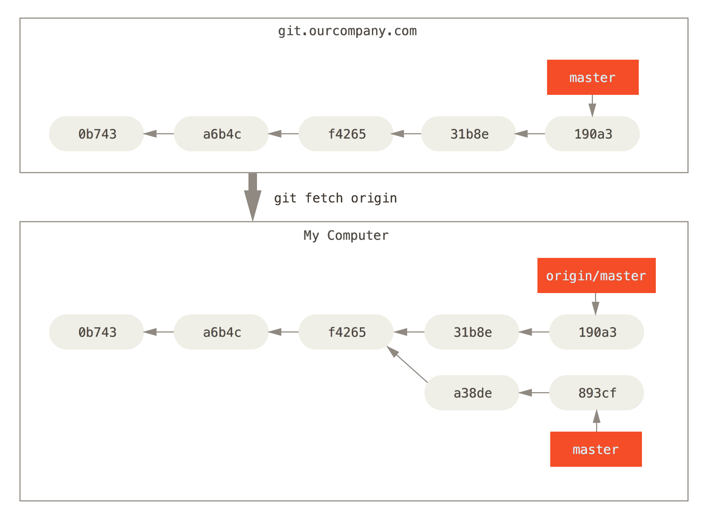

# 第2回 Gitハンズオン勉強会 (発展編)

* 様々なブランチ統合 (fast-forward, non-fast-forward, rebase)
    * fast-forward と non-fast-forward
    * merge と rebase
    * rebaseを安心して使えるケース

## 様々なブランチ統合 (fast-forward, non-fast-forward, rebase)

### fast-forward と non-fast-forward

Gitのmergeには、fast-forward(早送り)、non-fast-forwardというオプションがあります。両者の違いは、「マージをした」という操作に対してコミットログを残すか、残さないか、というものです。

|モード|コマンド|マージコミットのログ|
|:-----------|:------------|:-----------|
| fast-forward | git merge --ff | 残さない |
| non-fast-forward | git merge --no-ff | 残す |

`~/.gitconfig`で下記の設定を行っていると、オプションを指定しない場合、常に`--no-ff`でマージを行うようになります。

```bash
[merge]
    ff = false
```

それでは、実際に２つのオプションをそれぞれ使用して、コミットログの差異を確認しましょう。

1. リポジトリを作成する

    ```bash
    $ cd
    # リポジトリ用ディレクトリ作成
    $ mkdir ff_noff_test
    $ cd ff_noff_test
    $ touch test.txt
    # リポジトリの初期化とコミット
    $ git init
    $ git add .
    $ git commit -m "1st commit on master"
    ```

1. ブランチで変更を加え、それぞれのオプションでマージを実行する

    **fast-forward の場合**

    ```bash
    # ブランチを作成
    $ git checkout -b topic
    # ファイルに変更を加えてコミットする
    $ echo "aiueo" >> test.txt
    $ git commit -m "topic commit"
    # masterブランチに切り替える
    $ git checkout master
    # topicブランチの変更をmasterブランチに統合(fast-forward)
    $ git merge --ff topic
    # コミットログにマージコミットが含まれていないことを確認する
    $ git log --graph --oneline --decorate
    ```

    **non-fast-forward の場合**

    ```bash
    # 再度topicブランチで変更を加える
    $ git checkout topic
    $ echo "kakikukeko" >> test.txt
    $ git commit -m "topic commit2"
    $ git checkout master
    # topicブランチの変更をmasterブランチに統合(non-fast-forward)
    $ git merge --no-ff topic
    # コミットログにマージコミットが含まれていることを確認する
    $ git log --graph --oneline --decorate
    ```

### merge と rebase

Gitでブランチ間の変更を統合する方法はmergeの他にrebaseという方法があります。

|コマンド|振る舞い|
|:-----------|:------------|
| merge | 統合先(master)に、統合元(topic)の変更を、時系列順に合流させる |
| rebase | 統合元(topic)の変更を、統合先(master)の変更の<strong>後に</strong>、<strong>別のコミットとして</strong> 再登録する |

* mergeとrebaseの違い

    

それでは、実際に２つのブランチの統合をmerge/rebaseそれぞれで行い、コミットログの差異を確認しましょう。

1. リポジトリを作成する

    ```bash
    $ cd
    # リポジトリ用ディレクトリ作成
    $ mkdir merging_test
    $ cd merging_test
    $ echo "1234" >> test.txt
    # リポジトリの初期化とコミット
    $ git init
    $ git add .
    $ git commit -m "1st commit on master"
    ```

1. 2つのブランチでそれぞれ変更を加える

    ```bash
    # 現時点のmasterを元にtopicブランチを作成
    $ git checkout -b topic
    # masterブランチに戻って変更を加える
    $ git checkout master
    $ echo "5678" >> test.txt
    $ git add .
    $ git commit -m "2nd commit on master"
    # topicブランチに移動して変更を加える
    $ git checkout topic
    $ echo "aiueo" >> test2.txt
    $ git add .
    $ git commit -m "commit on topic"
    # masterブランチに戻る
    $ git checkout master
    ```

3. リポジトリを２つcloneして、mergeとrebaseの違いを確認する

    ```bash
    $ cd
    # リポジトリをcloneする
    $ git clone merging_test for_merge
    $ git clone merging_test for_rebase
    ```

    まずはmergeの確認

    ```bash
    $ cd ~/for_merge
    $ git merge origin/topic
    # merge後のコミットログを確認
    $ git log --graph --oneline --decorate
    ```

    次にrebaseの確認

    ```bash
    $ cd ~/for_rebase
    $ git rebase origin/topic
    # rebase後のコミットログを確認
    $ git log --graph --oneline --decorate
    ```

上記で、以下の違いが確認できるかと思います。

* merge
    * マージコミットが作成されていること
    * 各コミットのハッシュ値が変化していないこと
* rebase
    * マージコミットが作成されていないこと
    * 各コミットの時系列順やハッシュ値が変化していること

rebaseについては、実行前と実行後で既にコミットされた変更が、別のコミットとして登録されてしまうので、既にリモートリポジトリにpush済みの場合などは注意が必要です。（他の人が取り込んでいると、rebase後取り込みに失敗したり、pushに失敗したりする）

したがって、運用に慣れない間は、特に必要が無い場合、次の用途を除いてrebaseの使用を避ける方が良いとされています。

### rebaseを安心して使えるケース

ローカルでは変更が発生せず、リモート側の変更を取り込むだけのブランチ統合の場合、rebaseを使用しても問題が発生する事はありません。
また、rebaseのマージコミットが残らないという特性を活かし、以下のような運用をすることが一般的です。

1. merge時のオプションは必ず`--no-ff`を使用するよう`~/.gitconfig`に設定する
2. master等の統合ブランチの最新化は `fetch` + `rebase` で行う

```bash
$ git fetch origin
$ git rebase origin/master master
```

また、同じことを`git pull`に`--rebase`オプションを付けることでも実現できます。

```bash
$ git pull --rebase origin
```

`git pull`が fetch + merge を一度に行ってくれるのに対し、`git pull --rebase`は fetch + rebase を一度に行ってくれる事を意味します。


## (補足) fetch + merge の意味を詳しく知りたい人向け

fetchとmergeを理解するには、まずGitのブランチの種類を知る必要があります。
Gitのブランチは大きく以下の３つのブランチに分類されます。

|種類|説明|場所|
|:-----------|:------------|:-----------:|
| リモートブランチ | リモートリポジトリ上のブランチ | リモート |
| リモート追跡ブランチ | リモートブランチと関連付けられたローカル上のブランチ| ローカル |
| ローカルブランチ | ローカル上の作業ブランチ | ローカル |


リモート追跡ブランチはcloneやfetchを実行した際に、自動でローカル上に作成されます。
ローカル上に存在するブランチは、`git branch -a`で確認する事ができ、それぞれ以下のブランチを示しています。

```bash
$ git branch -a
* master # ローカルブランチ
remotes/origin/HEAD -> origin/master
remotes/origin/master　# origin上のmasterブランチのリモート追跡ブランチ
```

* ブランチのイメージ図

    

上記を踏まえて、fetchとmergeがそれぞれ何をやっているかを解説します。

* `git fetch` →　リモートブランチの変更をリモート追跡ブランチに取り込む
* `git merge <リモート追跡ブランチ> <ローカルブランチ>` →　ローカルブランチにリモート追跡ブランチの内容をマージする

リモートの変更をローカルに取り込もうとする際、思いがけずコンフリクトが発生してしまうことがあります。そんな時は上記を思い出して下さい。
