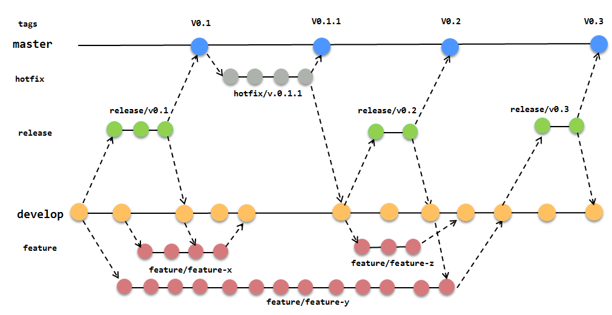
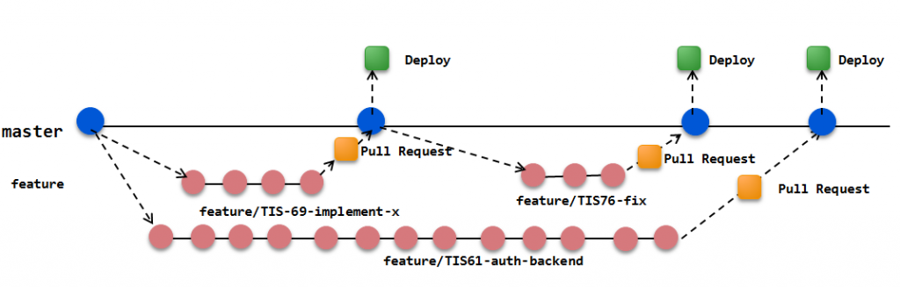
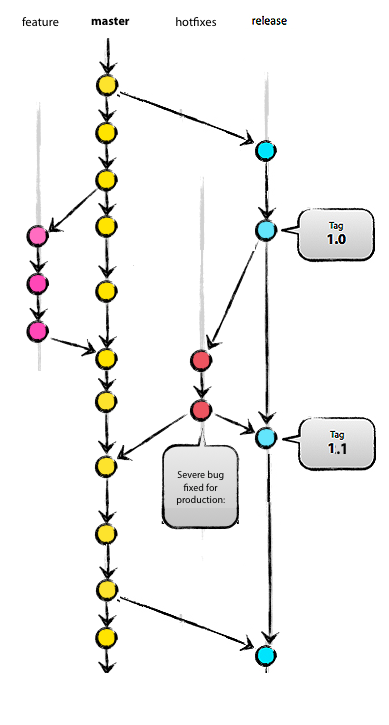

# 第3回 Gitハンズオン勉強会

## アジェンダ

1. 基本的なGitコマンド操作の学習④
    * tagの管理
1. 実践的なブランチ戦略と開発フロー
    * Git Flow
    * Github Flow
    * 楽楽精算スマホアプリ開発におけるブランチ戦略
1. まとめ
    * なぜGitか？Git導入のメリットとは？

## 基本的なGitコマンド操作④

### tagの管理

#### 事前準備

* Github上に、`study-tag`リポジトリを作成する
* ローカルにcloneする
* 以下の通り、commitとpushを実行する

```bash
echo "line 1" >> README.md
git add .
git commit -m "add line 1"
echo "line 2" >> README.md
git add .
git commit -m "add line 2"
git push origin master
```

#### タグを打つ (コミットに名前を付けて管理する)

ある特定のコミットに別名(タグ)をつけて管理することができます。
以下のコマンドを実行すると、現在の最新のコミットに対してタグが打たれます。

```bash
git tag -a <tag名> -m "<注釈>"
```

*実行例*

```bash
git tag -a v1.0.0 -m "v1.0.0 リリース"
```

タグをリモートリポジトリに反映するには、`git push`を実行します。

```bash
git push <リポジトリ名> <tag名>
```

*実行例*

```bash
git push origin v1.0.0
```

>もし他の開発者がタグを打ち、リモートにpushしていた場合は、`fetch`や`pull`を実行すると
>ローカルにもタグが反映されます。

タグの内容を確認するには以下のコマンドを実行します。

```bash
git show <タグ名>
```

*実行例*

```bash
git show v1.0.0
```

#### 過去のコミットにタグを打つ

過去の特定のコミットにタグを打つには、`git tag`の引数にコミットを渡します。

```bash
git tag -a <tag名> -m "<注釈>" <commit>
```

*実行例*

```bash
# 変更を加えながら、何度かコミットを実行する
echo "line A" >> README.md
git add .
git commit -m "add line A"
echo "line B" >> README.md
git add .
git commit -m "add line B"
echo "line C" >> README.md
git add .
git commit -m "add line C"

# さて、あなたはここでline Bを追加した時点で、v1.0.1をリリースしていたが、タグを打ち忘れていたことに気付きます。
################################################################
$ git log
commit 9d1ede0f39997d20d11e75fa2c699b13e293117e
Author: takayukifujisawa
Date:   Mon Nov 16 13:51:46 2015 +0900

    add line C

commit 24e7e994e778ebc6fc0b982b1841ece2b34658c5
Author: takayukifujisawa
Date:   Mon Nov 16 13:51:28 2015 +0900

    add line B

commit a2bad7b0e2877063e1b44c48c43926fcd4ded6b5
Author: takayukifujisawa
Date:   Mon Nov 16 13:50:51 2015 +0900

    add line A
################################################################

# 過去のコミットにタグを打つ(ハッシュ値がそれぞれの環境で異なるのでご注意ください)
git tag -a v1.0.1 -m "v1.0.1 リリース" 24e7e994e778ebc6fc0b982b1841ece2b34658c5
# リモートにpush
git push origin v1.0.1
# タグを確認
git show v1.0.1
```

#### タグの一覧を確認する

タグの一覧を表示するには、以下のコマンドを実行します。

```bash
git tag
```

*実行例*

```bash
#-nオプションは、注釈も一緒に表示するオプションです。
$ git tag -n
v1.0.0 v1.0.0 リリース
v1.0.1 v1.0.1 リリース
```

#### タグとの差分を比較する

タグとの比較をするには、`git diff`コマンドを使用します。
以下のコマンドで、最新のコミットとタグとの比較を行うことができます。

```bash
git diff <タグ名>
```

*実行例*

```bash
git diff v1.0.0
```

タグ同士の比較を行うには、以下のようにコマンドを実行します。

```bash
git diff <タグ名> <タグ名>
```

*実行例*

```bash
git diff v1.0.0 v1.0.1
```

#### タグが打たれたソースコードを参照する

過去のバージョンを再現し、動作確認をする際など、特定のタグを指定して、作業ディレクトリをその時点のソースコードに切り替えたい場合があります。
その際は、`git checkout`を使用します。

```bash
git checkout <タグ名>
```

*実行例*

```bash
git checkout v1.0.0
```

## 実践的なブランチ戦略と開発フロー

### Git Flow

* [A successful Git branching model](http://nvie.com/posts/a-successful-git-branching-model/) ([和訳](http://keijinsonyaban.blogspot.jp/2010/10/successful-git-branching-model.html))

#### 特徴

* ブランチの用途、ワークフローが厳格に定義されている
* フローに則って開発を行うことで統制を取りやすく、大規模な開発に向いている
* ブランチの運用（分岐・統合のタイミング、分岐元・統合先のブランチ）に慣れるまではややこしく感じる

#### ブランチツリー



#### ブランチの種類

##### master

* リリース済みの最新の安定バージョンを管理するブランチ
    * このブランチに対して直接ソースコードをcommit、pushしない
    * このブランチでtagを管理します

##### develop

* 次期リリース向けの最新の開発バージョンを管理するブランチ
    * このブランチに対して直接ソースコードをcommit、pushしない

##### feature

* 開発機能毎のブランチ
    * 機能単位でブランチを作成する
    * 機能単位の単体テストや受け入れテストはこのブランチで行う
    * 単体テスト（＆受け入れテスト）後、`develop`にマージする
* 分岐元：`develop`
* 統合先：`develop`

##### release

* リリース作業用のブランチ
    * リリースする機能が出揃ったタイミングで、`develop`から作成する
    * 結合テストはこのブランチで行う
    * バージョン番号の繰り上げや、結合テスト中に発見された不具合の修正、その他リリースに関係するコミットはこのブランチに対して行う
    * 結合テスト後、このブランチをDeployする
    * リリース完了後、`develop`と`master`にマージする
* 分岐元：`develop`
* 統合先：`develop` & `master`

##### hotfix

* リリース済み機能の緊急修正用のブランチ
    * リリース済みの機能に緊急で修正が必要な不具合や障害が発生した場合に、`master`から作成し、修正作業を行う
    * 作業完了後、（バージョン番号の繰り上げやその他リリースに関係する作業を行った後、）このブランチをDeployする
    * リリース完了後、`develop`と`master`にマージする
* 分岐元：`master`
* 統合先：`develop` & `master`

#### ブランチの寿命

* 常に存在するブランチ
    * master
    * develop
* 必要に応じて作成し、役目が終われば削除するブランチ
    * feature
    * release
    * hotfix

#### ブランチの命名

feature, release, hotfix ブランチの命名に特に決まりはありません。

*命名例*

* 123/single-sign-on
    * ブランチの種類：`feature`
    * ブランチの目的：シングルサインオン機能の開発
* release-v1.0.0
    * ブランチの種類：`release`
    * ブランチの目的：v1.0.0のリリース作業用
* hotfix/v1.2.1/fix-OOM
    * ブランチの種類：`hotfix`
    * ブランチの目的：OutOfMemoryの不具合修正をv1.2.1で緊急マイナーリリース

### Github FLow

* [Github Flow (Scott Chacon's Blog)](http://scottchacon.com/2011/08/31/github-flow.html) ([和訳](https://gist.github.com/kawanamiyuu/510e0e18f7b59d7e5f47))

#### 特徴

* Git Flowの重厚なブランチ運用に対する分かりにくさや手間を解消する、より単純化されたフロー
* Githubの使用を前提に、Pull Requestによるコードレビュー
* Githubを中心に据え、自動テスト・自動デプロイを駆使し、短い開発スパンで成果物をリリースする、スピード感のある開発スタイル

#### ブランチツリー



#### ブランチの種類

##### master

* 次期リリース向けの最新の開発バージョンを管理するブランチ
    * このブランチに対して直接ソースコードをcommit、pushしない
    * このブランチでtagを管理します
    * リリースする機能が出揃ったタイミングで、このブランチをDeployする

##### feature

* `master`に何らかの変更を加えるためのブランチ
    * トピック（機能開発、不具合修正、etc）単位で`master`から作成する
* 分岐元：`master`
* 統合先：`master`

#### ブランチの寿命

* 常に存在するブランチ
    * master
* 必要に応じて作成し、役目が終われば削除するブランチ
    * feature

#### ブランチの命名

feature ブランチの命名に特に決まりはありません。

### 楽楽精算スマホアプリ開発におけるブランチ戦略

* [RS-NativeApps/coding-standards/work-flow.md](http://192.168.0.4:8080/gitbucket/RS-NativeApps/coding-standards/blob/master/work-flow.md)
    * Issueやラベルの運用も含めた開発フロー全体について定義したドキュメント

#### 特徴

* プロジェクト開始当初はスピード感の出やすい **Github Flow** を採用していた
* アプリのファーストリリースに際し、リリース作業のためのブランチ`release`を用意し、リリース準備中も`master`で次期開発を行えるようにフローを変更した

#### ブランチツリー



#### ブランチの種類

##### master

* 次期リリース向けの最新の開発バージョンを管理するブランチ
    * このブランチに対して直接ソースコードをcommit、pushしない

##### feature

* `master`に何らかの変更を加えるためのブランチ
    * トピック（機能開発、不具合修正、etc）単位で`master`から作成する
* 分岐元：`master`
* 統合先：`master`

##### release

* リリース作業用のブランチ
    * リリースする機能が出揃ったタイミングで、`master`のすべての変更をマージする
    * 結合テストはこのブランチで行う
    * バージョン番号の繰り上げや、結合テスト中に発見された不具合の修正、その他リリースに関係するコミットはこのブランチに対して行う
    * 結合テスト後、このブランチをDeployする
    * リリース後、`master`にマージする
    * このブランチでtagを管理します


##### hotfix

* リリース済み機能の緊急修正用のブランチ
    * リリース済みの機能に緊急で修正が必要な不具合や障害が発生した場合に、`master`から作成し、修正作業を行う
    * 修正作業完了後、`release`にマージし、デプロイする
    * 開発中のバージョンにも反映するため、`master`にもマージする
* 分岐元：`release`
* 統合先：`release` & `master`

#### ブランチの寿命

* 常に存在するブランチ
    * master
    * release
* 必要に応じて作成し、役目が終われば削除するブランチ
    * feature
    * hotfix

#### ブランチの命名

feature, hotfix ブランチの命名に特に決まりはありません。

## まとめ

### なぜGitか？Git導入のメリットとは？
